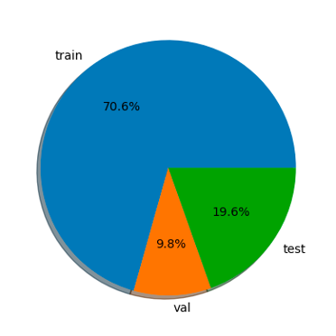

# Ensemble PhoBERT & FastText in Vietnamese Sentiment Analysis task

UPDATE:

* Optimize code directory structure

TO DO:

* fix ensemble procedure
* Containerize with Docker

## Dataset

I used [UIT-VSFC (Vietnamese Students’ Feedback Corpus)](https://www.researchgate.net/publication/329645066_UIT-VSFC_Vietnamese_Students%27_Feedback_Corpus_for_Sentiment_Analysis) dataset in this project. This dataset collected students feedback about the school after every semester from 2013 to 2016. It contains over 16,000 sentences with 2 tasks: **sentiments** and **topics**. In this project I just experimented with sentiment task only.

In sentimenst task, there are 3 labels: `0: Positive`, `1:Neural` and `2:Negative`. The distriution of this task is highly imbalanced, most of the label in `Positive` and `Negative` which tremendously affect the performance.

<p align="center" float="left">
  
   
</p>

## Model

- Finetune [PhoBERT](https://arxiv.org/abs/2003.00744) on downstream task.
- Build a [FastText](https://arxiv.org/abs/2003.00744) embedding on train+val corpus, `vector_dim=300`.

I experimented on these models:
- `PhoBERT(base/large) + FeedForward`.
- `PhoBERT(base/large) + LSTM`.
- `FastText + LSTM`.
- `FastText + SVM`.

## Experiment
- Use [CrossEntropyLoss](https://pytorch.org/docs/stable/generated/torch.nn.CrossEntropyLoss.html) as loss function.
- Final Dense Layer used [LogSoftmax](https://pytorch.org/docs/stable/generated/torch.nn.LogSoftmax.html) as acivation function. Experiment shows that it not only helps training process more stable but also improves performance.
- Finetuning PhoBERT(large) on Google Colab always faced with `OOM`, I used [Gradient Accumulation](https://pytorch-lightning.readthedocs.io/en/stable/advanced/training_tricks.html#accumulate-gradients) to fix this issue.
- Finetune PhoBERT with Adam optimizer, `learning_rate=1e-4`, apply [OneCycleLR](https://pytorch.org/docs/stable/generated/torch.optim.lr_scheduler.OneCycleLR.html) learning rate scheduler with `max_lr=learning_rate`.
- FastText_LSTM also use Adam optimizer, `learning_rate=1e-3`, apply [OneCycleLR](https://pytorch.org/docs/stable/generated/torch.optim.lr_scheduler.OneCycleLR.html) learning rate scheduler with `max_lr=learning_rate`.
- First experiment show on Confusion Matrix that majority of models's performance not good in predicting `1:Neural` because of Imbalanced dataset.
- Ensemble model on first experiment does not significantly improve the model's performance.
- Then experiment with [class_weight](https://scikit-learn.org/stable/modules/generated/sklearn.utils.class_weight.compute_class_weight.html) in order to due with class imbalanced improved Precision and F1-score on all models.
- Ensemble model with second experiment improve all models's performance.

<p align="center">
<b>Ensemble_pred= ratio * pred1 + (1-ratio) * pred2</b>
</p>

- `ratio` in range[0, 1]

- `pred1` is the model with superior performance, `pred2` vice versa. `Ensemble_pred` compares result with `pred1`'s model.

## Directory Structure
Expect directory structure be like:
```
├── /config
├── /data
│   ├── README.txt
│   ├── dev
│   │   ├── sentiments.txt
│   │   ├── sents.txt
│   │   └── topics.txt
│   ├── test
│   │   ├── sentiments.txt
│   │   ├── sents.txt
│   │   └── topics.txt
│   └── train
│       ├── sentiments.txt
│       ├── sents.txt
│       └── topics.txt
├── /src
├── ensemble.py
├── main.py
├── requirements.txt
├── test.sh
├── train.sh
├── train_fasttext.sh
├── train_svm.sh
└── utils.py
```

`data` is the `UIT-VSFC` downloaded

## Run code

Run the following command for execution information:
```
python main.py --help
```

1. Install dependencies
```
pip install -r requirements.txt
```

2. Train FastText Embedding
```
bash train_fasttext.sh
```

3. Train BERT-base models & FastText-LSTM
* Check hyperpamter at `config` folder, modify it as your need
```
bash train.sh
```

4. Test BERT-base models & FastText-LSTM
```
bash test.sh
```

## Result

### Evaluation on Test Set

| Model | Precision | Recall | F1-score |
| ----- | --------- | ------ | -------- |
| `(1) PhoBERT (base) + FeedForward` | **0.92502** | **0.92988** | **0.92348** |
| `(2) PhoBERT (large) + FeedForward` | 0.91447 | 0.90935 | 0.88475 |
| `(3) PhoBERT (base) + LSTM` | 0.92399 | 0.92893 | 0.92259 |
| `(4) PhoBERT (large) + LSTM` | 0.91062 | 0.90556 | 0.88104 |
| `(5) FastText + LSTM` | 0.84022 | 0.86323 | 0.84127 |
| `(6) FastText + SVM` | 0.84825 | 0.86639 | 0.85023 |

### **Emsemble** evaluation on Test Set

| Model | Ratio | Precision | Recall | F1-score |
| ----- | ----- | --------- | ------ | -------- |
| `(2) + (6)` | 0.5 | **0.89417** | **0.91124** | **0.88877** |
| `(2) + (4)` | 0.7 | 0.91587 | 0.91093 | 0.88627 |
| `(2) + (5)` | 0.8 | 0.91521 | 0.91030 | 0.88565 |
| `(4) + (6)` | 0.2 | 0.89082 | 0.90556 | 0.88562 |
| `(4) + (5)` | 0.7 | 0.91145 | 0.90651 | 0.88195 |
| `(5) + (6)` | 0.4 | 0.85532 | 0.87208 | 0.85340 |


### Evaluation on Test set with **class weights**

| Model | Precision | Recall | F1-score |
| ----- | --------- | ------ | -------- |
| `(1) PhoBERT (base) + FeedForward` | **0.92867** | **0.92672** | **0.92751** |
| `(2) PhoBERT (large) + FeedForward` | 0.90756 | 0.9024 | 0.87796 |
| `(3) PhoBERT (base) + LSTM` | 0.92489 | 0.92356 | 0.92407 |
| `(4) PhoBERT (large) + LSTM` | 0.90965 | 0.90461 | 0.8801 |
| `(5) FastText + LSTM` | 0.85727 | 0.81207 | 0.83015 |
| `(6) FastText + SVM`  | 0.85376 | 0.86229 | 0.85561 |

### **Ensemble** Evaluation on Test set with **class weights**

| Model | Ratio | Precision | Recall | F1-score |
| ----- | ----- | --------- | ------ | -------- |
| `(1) + (4)` | 0.8 | **0.92845** | **0.92956** | **0.92889** |
| `(1) + (2)` | 0.9 | 0.92899 | 0.92798 | 0.92837 |
| `(1) + (6)` | 0.5 | 0.92932 | 0.92830 | 0.92830 |
| `(1) + (5)` | 0.9 | 0.92943 | 0.92672 | 0.92783 |
| `(3) + (4)` | 0.8 | 0.92507 | 0.92704 | 0.92584 |
| `(3) + (6)` | 0.8 | 0.92545 | 0.92451 | 0.92484 |
| `(3) + (5)` | 0.6 | 0.92654 | 0.92356 | 0.92474 |